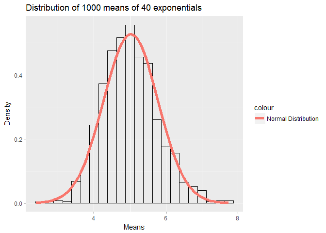
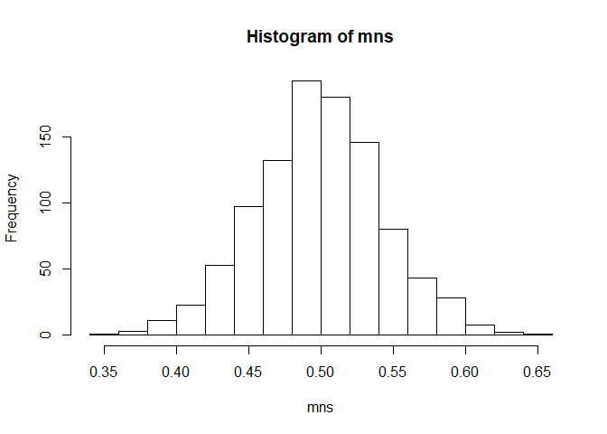

### Course6Project.Rmd (Statistics Course Project)

Autoz
2017年11月28日

### Introduction

This project is about Statistical Inference Course Project. It consists of two parts:

1.A simulation exercise.

2.Basic inferential data analysis.

### Part 1: Simulation Exercise Instructions Background

Illustrate via simulation and associated explanatory text the properties of the distribution of the mean of 40 exponentials.

Plot Project Samples
--------------------

Distribution of 1000 random uniforms

``` r
hist(runif(1000))
```


The distribution of 1000 averages of 40 random uniforms.This distribution looks far more Gaussian than the original uniform distribution!

``` r
mns = NULL
for (i in 1 : 1000) mns = c(mns, mean(runif(40)))
hist(mns)
```




Initialize Set Parameters
-------------------------

At first set the global variables

``` r
library(ggplot2)
lamda <- .2 
tmean <- 1/lamda # theoritical mean
tsd <- 1/lamda # theoritical standard deviation
nsim <- 1000 # simulate 1000
nsize <- 40 # scales
```

1.Show the sample mean and compare it to the theoretical mean of the distribution.
----------------------------------------------------------------------------------

Analysis of Sample Mean vs. Theoretical Mean. Plot 40 random exponentials distribution

``` r
hist(rexp(n = nsize,lamda),
     xlab = "40 random exponentials distribution",
     ylab = "Density",
     breaks = 40)
```


Calculate the distribution of 1000 averages of 40 random exponentials

``` r
mns <- replicate(n = nsim,
                 expr = mean(rexp(n = nsize,
                                  lamda))) #sample means distributions
smean <- mean(mns) # means mean
ssd <- sd(mns) # sd mean
meandata <- data.frame(Mean.Title=c("Sample Mean", 
                                    "Theoretical Mean"),
                       Mean.Values=c(smean, tmean)) # variance dataframe
meandata
```

    ##         Mean.Title Mean.Values
    ## 1      Sample Mean    5.023101
    ## 2 Theoretical Mean    5.000000

Plot the distribution of comparison

``` r
ggplot(data.frame(means = mns), aes(x = mns))+
    geom_histogram(aes(y = ..density..),color = "black", fill = 'NA',
                        binwidth=.25)+
    geom_vline(data = meandata,aes(xintercept = Mean.Values, 
                                   color = Mean.Title,
                                   linetype = Mean.Title),
               lwd=1.2 ,show.legend=TRUE)+
    labs(title="Distribution of Sample Mean vs. Theoretical Mean",
         x="Means", y="Density")
```


Sample mean is (via variance) very close to theoretical mean according to the distribution.

2.Show how variable the sample is (via variance) and compare it to the theoretical variance of the distribution.
----------------------------------------------------------------------------------------------------------------

``` r
svar <- var(mns) # sample variance
tvar <-  1/(lamda^2*nsize) # theoritical variance
vardata <- data.frame(Var.Title=c("Sample Variance", "Theoretical Variance"),
                      Var.Values=c(svar, tvar)) # variance dataframe
vardata
```

    ##              Var.Title Var.Values
    ## 1      Sample Variance  0.5739065
    ## 2 Theoretical Variance  0.6250000

Sample variance is very close to theoretical variance according to the distribution.

3.Show that the distribution is approximately normal.
-----------------------------------------------------

``` r
ggplot(data.frame(means = mns), aes(x = mns))+
    geom_histogram(aes(y = ..density..),color = "black", fill = 'NA',
                        binwidth=.25)+
    stat_function(fun = dnorm, args = list(mean = smean, sd = ssd),
                  aes(color = "Normal Distribution"),size=2)+
    labs(title="Distribution of 1000 means of 40 exponentials",
         x="Means", y="Density")
```


### Part 2:Basic Inferential Data Analysis Instructions

Now in the second portion of the project, we're going to analyze the ToothGrowth data in the R datasets package.

1.Load the ToothGrowth data and perform some basic exploratory data analyses
----------------------------------------------------------------------------

``` r
data("ToothGrowth")
str(ToothGrowth)
```

    ## 'data.frame':    60 obs. of  3 variables:
    ##  $ len : num  4.2 11.5 7.3 5.8 6.4 10 11.2 11.2 5.2 7 ...
    ##  $ supp: Factor w/ 2 levels "OJ","VC": 2 2 2 2 2 2 2 2 2 2 ...
    ##  $ dose: num  0.5 0.5 0.5 0.5 0.5 0.5 0.5 0.5 0.5 0.5 ...

``` r
head(ToothGrowth)
```

    ##    len supp dose
    ## 1  4.2   VC  0.5
    ## 2 11.5   VC  0.5
    ## 3  7.3   VC  0.5
    ## 4  5.8   VC  0.5
    ## 5  6.4   VC  0.5
    ## 6 10.0   VC  0.5

2.Provide a basic summary of the data.
--------------------------------------

``` r
summary(ToothGrowth)
```

    ##       len        supp         dose      
    ##  Min.   : 4.20   OJ:30   Min.   :0.500  
    ##  1st Qu.:13.07   VC:30   1st Qu.:0.500  
    ##  Median :19.25           Median :1.000  
    ##  Mean   :18.81           Mean   :1.167  
    ##  3rd Qu.:25.27           3rd Qu.:2.000  
    ##  Max.   :33.90           Max.   :2.000

``` r
ggplot(aes(x=factor(dose), y=len), data=ToothGrowth) + 
    geom_boxplot(aes(fill=supp)) + 
    xlab("Supplement Dosages") + 
    ylab("Tooth Length") + facet_grid(~ supp) + 
    ggtitle("Tooth Length vs. Supplement Dosages by Supplement Types") + 
    theme(plot.title = element_text(lineheight=.8, face="bold"))
```


3.Use confidence intervals and/or hypothesis tests to compare tooth growth by supp and dose. (Only use the techniques from class, even if there's other approaches worth considering)
-------------------------------------------------------------------------------------------------------------------------------------------------------------------------------------

Subset data

``` r
g1 <- ToothGrowth$dose[1 : 10]; g2 <- ToothGrowth$dose[11 : 20]
dose1 <- ToothGrowth$dose %in% c(0.5,1.0)
dose2 <- ToothGrowth$dose %in% c(0.5,2.0)
dose3 <- ToothGrowth$dose %in% c(1.0,2.0)
```

Make t.test for each group

``` r
t1 <- t.test(len ~ supp, paired = TRUE, data = ToothGrowth)
t2 <- t.test(len ~ supp, paired = FALSE, data = ToothGrowth)
t3 <- t.test(len ~ dose,data = subset(ToothGrowth, dose1))
t4 <- t.test(len ~ dose,data = subset(ToothGrowth, dose2))
t5 <- t.test(len ~ dose,data = subset(ToothGrowth, dose3))
```

Comparison of t.test

``` r
testsum <- data.frame("p.values"=c(t1$p.value, t2$p.value,
                                     t3$p.value, t4$p.value,
                                     t5$p.value), 
                       "confidence.low"=c(t1$conf.int[1], t2$conf.int[1],
                                          t3$conf.int[1], t4$conf.int[1],
                                          t5$conf.int[1]),
                       "confidence.high"=c(t1$conf.int[2], t2$conf.int[2],
                                           t3$conf.int[2], t4$conf.int[2],
                                           t5$conf.int[2]),
                      row.names = c("len ~ supp | paired",
                                    "len ~ supp | no paired",
                                    "len ~ dose | 0.5,1.0",
                                    "len ~ dose | 0.5,2.0",
                                    "len ~ dose | 1.0,2.0"))
testsum
```

    ##                            p.values confidence.low confidence.high
    ## len ~ supp | paired    2.549842e-03      1.4086586        5.991341
    ## len ~ supp | no paired 6.063451e-02     -0.1710156        7.571016
    ## len ~ dose | 0.5,1.0   1.268301e-07    -11.9837813       -6.276219
    ## len ~ dose | 0.5,2.0   4.397525e-14    -18.1561665      -12.833833
    ## len ~ dose | 1.0,2.0   1.906430e-05     -8.9964805       -3.733519

1.According to the analysis, the confidence interval of len ~ supp (paired or no paired) didn't reject the H0, So that there are no correlations between supplement types and tooth length). 2.In contrast, the confidence intervals len ~ dose (\[0.5,1.0\],\[0.5,2.0\],\[1.0,2.0\]) success to reject the H0. It means that there are significant correlations between supplement dosages and tooth length.

4.State your conclusions and the assumptions needed for your conclusions.
-------------------------------------------------------------------------

Summarise for the anasysis, when supply 0.5 and 1.0 mg dosages, orange juice affect tooth growth more than vitamin c. And about 2.0 mg dosages, tooth growth will not be a affect significant with different supplement types. In a word, supplement dosage is a key factor for tooth growth.


* THE END
