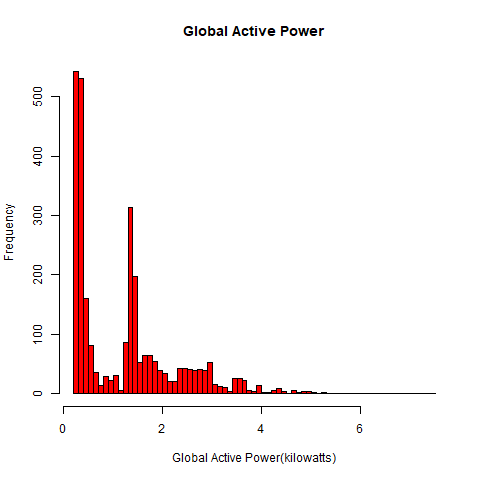
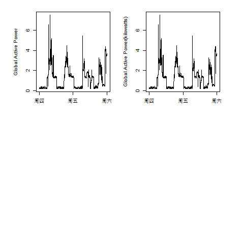
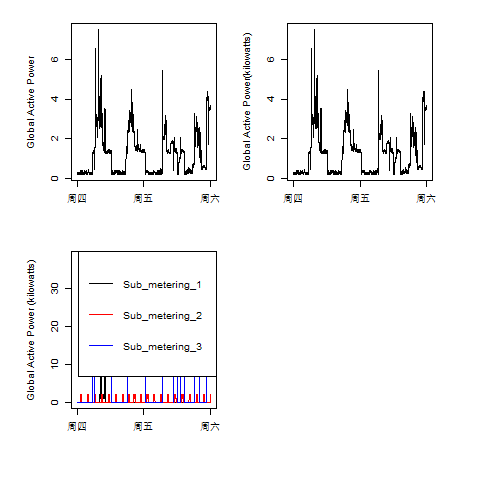
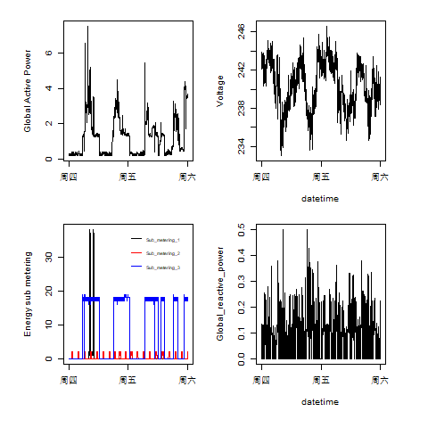

### ExDataProject.R

zhz
Tue Feb 06 15:59:45 2018

Cousera DS 的探索性数据分析 Course Project 1，具体问题忘记了当时没有记录下，大概记得目的是联系超大数据样本的Plot图分析。

[DATALINK](https://archive.ics.uci.edu/ml/machine-learning-databases/00235/household_power_consumption.zip)


``` r
# Plot 1
# loading the dataset into R

# setwd("D:/gitcode/Rlan")
# filename <- "EPC_dataset.zip"
# if (!file.exists("EPC dataset")) { 
#   unzip(filename) 
# }
library(tidyverse)
setwd("D:/gitcode/Rlan/course4_Explorary/ExData_Plotting1")
dat_EPC <- read_delim("household_power_consumption.txt",delim = ";",col_names = TRUE)
dat_EPC$Date <- as.Date(dat_EPC$Date,"%d/%m/%Y")
dat_EPC_sub <-subset(dat_EPC,Date >= as.Date("2007-2-1") & Date <= as.Date("2007-2-2"))

```
### No.1

``` r
hist(dat_EPC_sub$Global_active_power,main = "Global Active Power",
     xlab = "Global Active Power(kilowatts)",col = "Red",breaks = 100)
```

``` r
# save png
dev.copy(png, file="plot1.png", height=480, width=480)
dev.off()
```


### No. 2
``` r
SetTime <- paste(dat_EPC_sub$Date, dat_EPC_sub$Time)
SetTime <- strptime(SetTime, "%Y-%m-%d %H:%M:%S")
with(dat_EPC_sub,plot(SetTime,Global_active_power,type = "l",xlab = "",ylab = "Global Active Power(kilowatts)"))

# save png
dev.copy(png, file="plot2.png", height=480, width=480)
dev.off()
```


### No.3
``` r
with(dat_EPC_sub,{
    plot(SetTime,Sub_metering_1, type="l",
         ylab="Global Active Power (kilowatts)", xlab="")
    lines(SetTime,Sub_metering_2 ,col='Red')
    lines(SetTime,Sub_metering_3,col='Blue')
})
legend("topright", col=c("black", "red", "blue"), lwd=c(1,1,1), 
       c("Sub_metering_1", "Sub_metering_2", "Sub_metering_3"))

# save png
dev.copy(png, file="plot3.png", height=480, width=480)
dev.off()
```


### No.4
``` r
par(mfrow = c(2,2),mar=c(4,4,2,2), oma=c(2,2,0,2))
```
``` r
# plot1
with(dat_EPC_sub,plot(SetTime,Global_active_power,type = "l",xlab = "",ylab = "Global Active Power"))
# plot2
with(dat_EPC_sub,plot(SetTime,Voltage,type = "l",xlab = "datetime",ylab = "Voltage"))
# plot3
with(dat_EPC_sub,{
    plot(SetTime,Sub_metering_1, type="l",
         ylab="Energy sub metering", xlab="")
    lines(SetTime,Sub_metering_2 ,col='Red')
    lines(SetTime,Sub_metering_3,col='Blue')
})
legend("topright", col=c("black", "red", "blue"), lwd=c(1,1,1),bty = "n",
       c("Sub_metering_1", "Sub_metering_2", "Sub_metering_3"),cex = 0.5)
# plot4
with(dat_EPC_sub,plot(SetTime,Global_reactive_power,type = "l",xlab = "datetime",
                      ylab = "Global_reactive_power"))
```
``` r
# save png
dev.copy(png, file="plot4.png", height=480, width=480)
dev.off()
```


* THE END