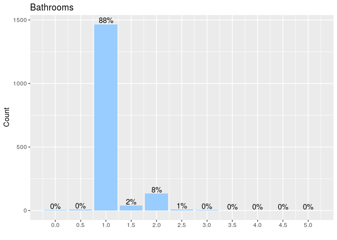
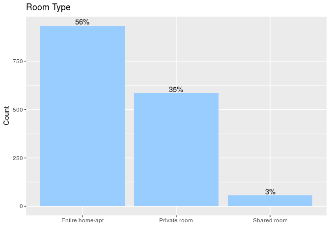
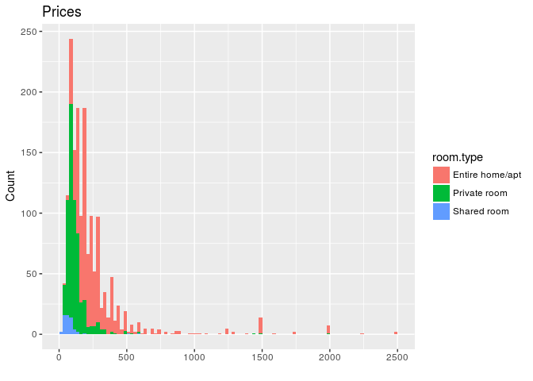
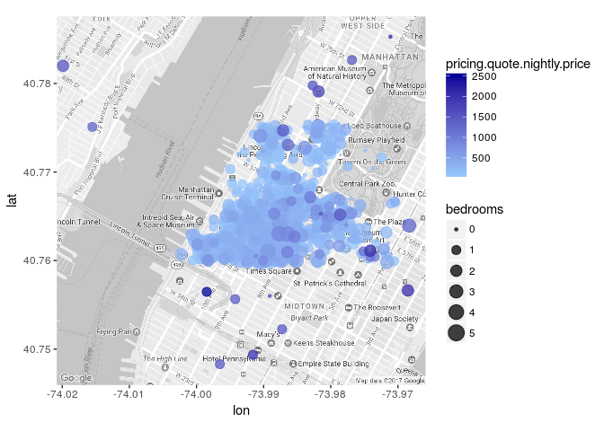

Rbnb
================
Alexander Kroeger, Noah Zinsmeister
2017-04-02

UPDATE (11/1/2017): We are aware that, unfortunately, this package is currently broken. Currently, neither author has the bandwidth to push fixes. This may change, but don't count on it. We hope that would-be users of Rbnb will be able to take inspiration from our code or, better yet, submit a pull request!

[](https://github.com/NoahZinsmeister/Rbnb.git)

===

<!-- MarkdownTOC autoanchor="true" autolink="true" uri_encoding="false" -->

- [Introduction](#introduction)
- [Installation](#installation)
- [Searching by Location](#searching-by-location)
    - [Metadata](#metadata)
    - [Results](#results)
- [Listing Details](#listing-details)
- [Price Prediction](#price-prediction)

<!-- /MarkdownTOC -->

<a id="introduction"></a>
Introduction 介绍
------------

Rbnb is an experimental front end for the (unofficial) Airbnb API. In addition to pulling detailed data on Airbnb listings based on arbitrary user-defined locations, Rbnb also provides a variety of visual summaries of these listings.

Rbnb是（非官方）Airbnb API的实验前端。除了根据用户定义的任意位置提取Airbnb列表的详细数据外，Rbnb还提供了这些列表的各种可视摘要。

Use cases include, but are not limited to:

-   Prospective Airbnb guests and hosts who want to get a sense of the Airbnb market in their target location.
-   Current Airbnb hosts who wish to see how the price of their existing listing compares to similiar listings in their area.
-   Researchers interesting in analyzing granual microdata on short-term rental markets.

The authors are grateful to [The Official Unofficial Airbnb API Docs](http://airbnbapi.org/) for documenting much of the Airbnb API.

用例包括但不限于：

希望了解目标地区Airbnb市场的Airbnb潜在客户和主办方。
目前Airbnb的主机希望了解其现有商品的价格与其所在地区的类似商家信息的比较情况。
研究人员有兴趣分析短期租赁市场的微观微观数据。

作者感谢The Official Unofficial Airbnb API Docs记录了大量的Airbnb API。

<a id="installation"></a>
Installation 安装
------------

Before we get started, let's install Rbnb

``` r
library(devtools)
devtools::install_github("NoahZinsmeister/Rbnb")
```

<a id="searching-by-location"></a>
Searching by Location 按位置搜索
---------------------

The first thing you may want to do after installing Rbnb is to try searching for listings in your current zip code. For example, one of the authors lives in 10019, a zip that includes Hell's Kitchen and midtown Manhattan. Let's pull listings data for this area.

``` r
library(Rbnb)

location = "10019"
content = Rbnb::searchLocation(location, verbose=FALSE)
```

Note: if you are unable to access the internet or the Airbnb API specifically, we've included a static pull of the 10019 data (`zip10019.rda`) that you can load in like so (in this example we'll be using the static pull):

``` r
data("zip10019", package="Rbnb")
content = zip10019
rm(zip10019)
```

And here's what we have!

``` r
str(content, max.level = 1)
```

    ## List of 3
    ##  $ passed.location: chr "10019"
    ##  $ metadata       :List of 3
    ##  $ results        :List of 2

As you can see, `searchLocation` returns a list with three elements: -passed.location -metadata -results

Let's take a closer look at these last two elements.

<a id="metadata"></a>
### Metadata 元数据

Airbnb spits out some interesting metadata when given a location.

``` r
str(content$metadata, max.level = 1)
```

    ## List of 3
    ##  $ num.listings: int 1664
    ##  $ geography   :List of 8
    ##  $ facets      :List of 6

In our example, Airbnb provided metadata on **1664** listings for your search term '**10019**'. Your search term was recognized as a **postal\_code**, specifically a **zip**, which Airbnb resolved to the following location: **New York**, **New York**, **United States**. We can even pull up the [center of our search area](http://maps.google.com/maps?t=m&q=loc:40.7686973+-73.9918181) on Google Maps.

The facets contain various distributional statistics, e.g.:

``` r
library(knitr)
kable(content$metadata$facets$bedrooms[1:5,])
```

|  value|  cumulative.count|  count|
|------:|-----------------:|------:|
|      0|              1664|    210|
|      1|              1454|   1141|
|      2|               313|    245|
|      3|                68|     50|
|      4|                18|     11|

We can use `describeMetadata` for a better look at some of these facets. For example, we can look at the distribution of bathrooms:

``` r
Rbnb::describeMetadata(content, facet = "bathrooms")
```



Or the room types:

``` r
Rbnb::describeMetadata(content, facet = "room.type")
```



If we only want to take a look at this metadata without going through the (sometimes lengthy) process of downloading individual listings, we can run the following:

``` r
Rbnb::searchLocation(location, metadata.only=TRUE, verbose=FALSE)
```

<a id="results"></a>
### Results 结果

Here's a look at the actual dataframe (tibble) we've pulled.

``` r
knitr::kable(content$results$data[1:5,c("name", "bedrooms", "neighborhood", "primary.host.first.name")])
```

| name                                              |  bedrooms| neighborhood   | primary.host.first.name |
|:--------------------------------------------------|---------:|:---------------|:------------------------|
| Private Micro Room 3                              |         1| Hell's Kitchen | Han                     |
| Quite Room in the 3BR Apartment near Times Square |         1| Hell's Kitchen | NaNa                    |
| Cozy Private Room in Times Square!                |         1| Hell's Kitchen | Brian                   |
| A Comfortable, Clean Room for Rent                |         1| Hell's Kitchen | Marco                   |
| Private room in Hell's Kitchen                    |         1| Hell's Kitchen | Reed                    |

This dataframe contains **1664** listings related to your search term '**10019**'.

We can use `describeResults` to plot the distribution of prices across room types.

``` r
Rbnb::describeResults(content)
```



And if we want to plot the location of listings on a map, we can use `showMap`.

``` r
Rbnb::showMap(content)
```

    ## Warning: bounding box given to google - spatial extent only approximate.

    ## converting bounding box to center/zoom specification. (experimental)

    ## Map from URL : http://maps.googleapis.com/maps/api/staticmap?center=40.766791,-73.993387&zoom=14&size=640x640&scale=2&maptype=roadmap&language=en-EN&sensor=false



<a id="listing-details"></a>
Listing Details 清单细节
---------------

In addition to pulling many listings for a given location, the Airbnb API allows you to pull detailed information for a particular listing. This more detailed information includes information such as the amenities offered by the listing (like wireless internet and air conditioning), the cancellation policy, and the description provided the host.

To allow users to access this data, we provide the functions `addDetails` and `listingDetails`. `addDetails` is meant to be used with `searchLocations`, and, as the name implies, it adds the detailed information to a dataset of listings like the `content$results$data`.

``` r
detailsAdded <- Rbnb::addDetails(contents$results$data)
```

`listingDetails` is more flexible, in that it allows you to pull a dataset of detailed listing information simply using a character vector of listing IDs.

Note that listing IDs can be found in the ID column of `content$results$data`. They can also be found in the URLs of Airbnb listings. For example, consider the listing URl `https://www.airbnb.com/rooms/12170773`. Here, the listing ID is `12170773`.

The line below would pull listing details for the first 20 listing IDs in `content$results$data`.

``` r
detailsAdded <- Rbnb::addDetails(contents$results$data[,1:20]$id)
```

Below we can see an example of detailed listing data. It's the result of adding details to the first 20 observations of the static `content$results$data.` The dataset, with 193 variables, is quite wide. 33 of these variables are indicators for various amenities.

``` r
data(detailsAdded,package="Rbnb")
knitr::kable(detailsAdded[1:5,c("name","neighborhood","amenity.Wireless.Internet")])
```

| name                                              | neighborhood   | amenity.Wireless.Internet |
|:--------------------------------------------------|:---------------|:--------------------------|
| Private Micro Room 3                              | Hell's Kitchen | TRUE                      |
| Quite Room in the 3BR Apartment near Times Square | Hell's Kitchen | TRUE                      |
| Cozy Private Room in Times Square!                | Hell's Kitchen | TRUE                      |
| A Comfortable, Clean Room for Rent                | Hell's Kitchen | TRUE                      |
| Private room in Hell's Kitchen                    | Hell's Kitchen | TRUE                      |

``` r
dim(detailsAdded)
```

    ## [1]  20 192

``` r
sum(grepl("^amenity.",names(detailsAdded)))
```

    ## [1] 33

<a id="price-prediction"></a>
Price Prediction 价格预测
----------------

Let's say we're looking at an existing Airbnb listing and are curious as to how its price compares with that of comparable listings in the same area. The function `predictPrice` will take in a particular listing ID and build a detailed dataset of nearby listings as a training dataset to predict a price based on listing characteristics. This will tell you whether a particular listing is under- or overvalued given its features. The prediction method is gradient boosting using the package `xgboost`. Advanced users can specify some of the parameters used for prediction!

The function will return a list containing the listing ID of interest, the current price, a predicted price, the training dataset used, and the data for the listing of interest.

One item to note is that pulling listing details can be quite time consuming. For this reason, there is a parameter in `pricePrediction` called `maxSample` that allows you to limit the number of nearby listings for which details are pulled in. Below is a sample call to `predictPrice`.

假设我们正在查看现有的Airbnb上市，并对其价格与同一地区的同类房源的价格相比感到好奇。该函数predictPrice将接收特定的列表ID，并构建附近列表的详细数据集作为训练数据集，以根据列表特征预测价格。这将告诉您特定列表是否因其功能而被低估或高估。预测方法是使用包的梯度增强xgboost。高级用户可以指定一些用于预测的参数！

该函数将返回一个列表，其中包含感兴趣的列表ID，当前价格，预测价格，使用的训练数据集以及感兴趣列表的数据。

需要注意的一个问题是，提取列表细节可能非常耗时。出于这个原因，pricePrediction调用maxSample了一个参数，允许您限制附加详细信息的列表的数量。下面是一个示例调用predictPrice。

``` r
price.prediction <- Rbnb::predictPrice(listingID="12170773",maxSample=500)
```

Here is `predictPrice` using static data instead of the API. Since no data is being pulled, `maxSample` is omitted. Note also your ability to pass xgboost parameters.

``` r
data("trainData", package="Rbnb")
data("listing.detail", package="Rbnb")

price.prediction <- Rbnb::predictPrice("12170773",
                    listing.detail = listing.detail, trainData = trainData,
                    # xgboost parameters for advanced users
                    nfold=10,  
                    nrounds=1000,
                    early_stopping_rounds=50,
                    max_depth=4,
                    eta=0.05)
```

    ## Starting Prediction.
    ## The predicted price based on similar listings is 163
    ## This represents a 14% premium to the current listing price.

``` r
str(price.prediction,max.level = 1)
```

    ## List of 5
    ##  $ listingID     : chr "12170773"
    ##  $ currentPrice  : num 143
    ##  $ predictedPrice: num 163
    ##  $ trainingData  :Classes 'tbl_df', 'tbl' and 'data.frame':  771 obs. of  70 variables:
    ##  $ listingData   :Classes 'tbl_df', 'tbl' and 'data.frame':  1 obs. of  70 variables:
